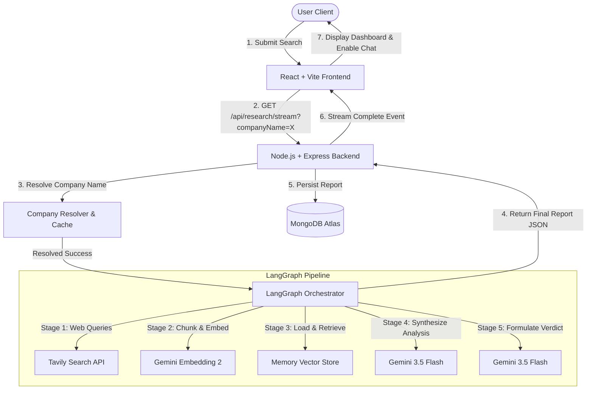
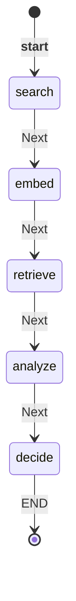
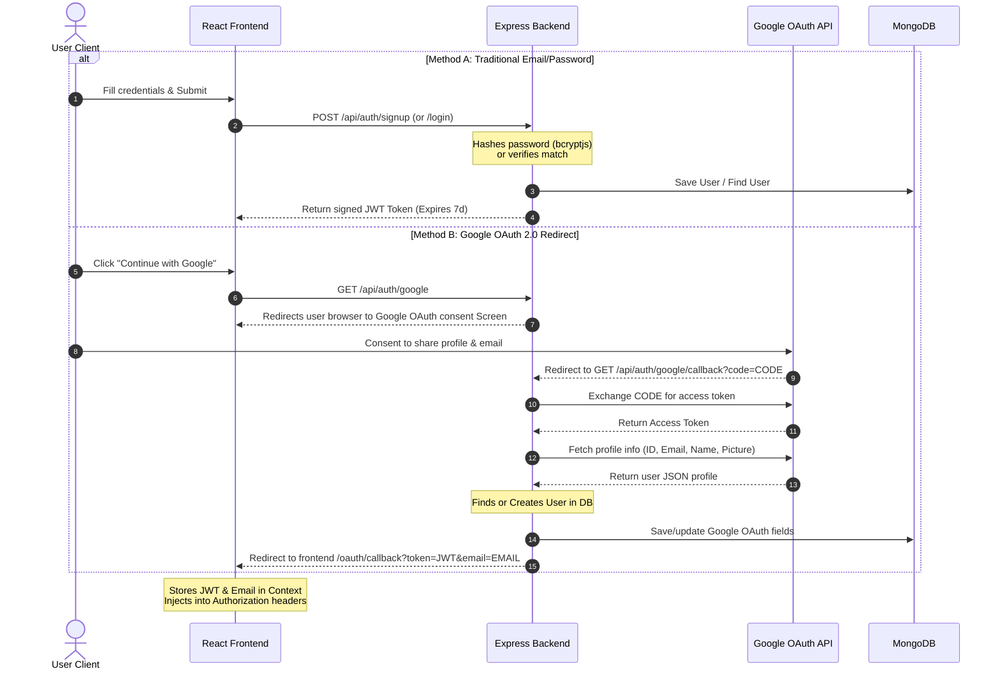

# InvestIQ System Architecture

This document describes the high-level system architecture, data flow, LangGraph cognitive workflow, Retrieval-Augmented Generation (RAG) pipeline, authentication lifecycle, and database schemas for **InvestIQ**.

---

## 1. High-Level System Architecture

InvestIQ is designed as a decoupled client-server application consisting of a React-based frontend terminal, an Express-based REST & streaming API backend, and an orchestrated LangGraph agent.

### Architectural Layers

1. **Presentation Layer (Frontend)**:
   - A single-page application (SPA) built using **React 19**, **Vite**, and **Tailwind CSS**.
   - Interfaces with the backend via REST for authentication and history queries.
   - Leverages HTML5 **Server-Sent Events (SSE)** via `EventSource` to receive real-time updates as the backend agent executes individual nodes of the research workflow.

2. **Orchestration Layer (Backend)**:
   - An asynchronous **Node.js** and **Express.js** web server.
   - Manages routing, error boundaries, session security, database operations, and external API requests.
   - Implements custom EventStream response headers to stream progress stages to the client.

3. **Company Resolution Layer**:
   - Mapped to **Twelve Data Symbol Search API** with a custom local fallback dictionary for rate-limiting protection.
   - Resolves ambiguous queries (e.g. `"Apple"` or `"TCS"`) to structured exchange data, filtering out derivatives and ETFs.
   - Includes a 24-hour in-memory `CompanyCache` to limit API usage.

4. **Workflow Engine (LangGraph)**:
   - Built with `@langchain/langgraph` utilizing `StateGraph`.
   - Manages a shared, typed memory state that accumulates search results, text chunks, similarity results, and analytical synthesis across multiple execution nodes.

5. **Data Layer (MongoDB)**:
   - Uses **Mongoose** to interact with a MongoDB database.
   - Stores users (hashed passwords or Google OAuth IDs) and synthesized research reports.

---

## 2. LangGraph Workflow

The core reasoning logic is modeled as a mathematical state graph where state transitions are controlled by node execution.

### Shared State Channels
The graph maintains a state containing:
- `companyName` (String): Raw search text.
- `resolvedCompany` (Object): Metadata containing ticker, exchange, country, currency, sector, and industry.
- `searchResults` (Array): Merged, deduplicated web search results from Tavily.
- `vectorStore` (MemoryVectorStore): In-memory vector database containing embedded chunks.
- `retrievedChunks` (Array): Semantic search results from vector memory.
- `analysisResult` (Object): Structured bull/bear case arguments and metric scores.
- `decisionResult` (Object): Structured final verdict, investment score, and confidence.
- `callbacks` (Object): Progress hooks triggered on transition completion.

### Node Transition Flow

1. **`searchNode`**:
   - Executes three concurrent search queries via Tavily:
     - `"<companyName> <ticker> recent news"`
     - `"<companyName> <ticker> financial performance"`
     - `"<companyName> <ticker> risks and controversies"`
   - Deduplicates findings by URL. If less than 3 unique results are returned, it automatically retries with broader queries.
2. **`embedNode`**:
   - Concatenates the title and description snippet of each search result.
   - Splits text into blocks using a word-boundary-safe chunking algorithm.
   - Generates vector embeddings via the `gemini-embedding-2` model and loads them into a new session-isolated `MemoryVectorStore`.
3. **`retrieveNode`**:
   - Performs three similarity searches against the memory vector database:
     - `"financial health and performance"`
     - `"market position and competitors"`
     - `"risks and controversies"`
   - Deduplicates matching chunks by exact content to build context for reasoning.
4. **`analyzeNode`**:
   - Passes context chunks to `gemini-2.5-flash` with `analysisSchema` structured output.
   - Generates a bull case (3-4 points), a bear case (3-4 points), and 0-100 scores across: Business Quality, Financial Health, Valuation, Growth Potential, and Risk.
5. **`decideNode`**:
   - Passes the synthesized analysis to `gemini-2.5-flash` using `decisionSchema` structured output.
   - Determines the final verdict (`Strong Buy`, `Buy`, `Hold`, `Pass`, `Avoid`), an overall investment score, confidence level, investment horizon, valuation status, suitable investor profile, and negative monitoring triggers (if Pass or Avoid).

---

## 3. RAG Pipeline & Vector Search

InvestIQ implements an on-the-fly, session-scoped RAG (Retrieval-Augmented Generation) pipeline rather than relying on a persistent vector database.

### 1. Chunking Strategy (`vectorStore.js`)
- Standard character splitting can break words or sentences, destroying semantics.
- `chunkText` splits cleaned text into ~500 character limits.
- Looks back up to 60 characters from the target slice point to split exactly at word boundaries (spaces).
- Excludes small chunks (under 5 characters) to remove noise.

### 2. Custom Memory Vector Store (`MemoryVectorStore`)
- Extends LangChain's base `VectorStore` class.
- Stores documents in a local memory array containing: `{ embedding, pageContent, metadata }`.
- **Query Resolution**:
  - Encodes retrieval query terms using the Gemini Embeddings model.
  - Loops over all elements in the internal array, calculating the **cosine similarity** between the query embedding and the stored chunk embedding.
  - Sorts results descending by similarity score and returns the top `k` matching documents.

$$\text{Cosine Similarity} = \frac{\mathbf{A} \cdot \mathbf{B}}{\|\mathbf{A}\| \|\mathbf{B}\|} = \frac{\sum_{i=1}^{n} A_i B_i}{\sqrt{\sum_{i=1}^{n} A_i^2} \sqrt{\sum_{i=1}^{n} B_i^2}}$$

---

## 4. Authentication Lifecycle

InvestIQ provides a dual-method authentication system supporting secure local credentials and Google OAuth 2.0.

- **JWT Helper**: Token payload embeds user ID and email, signed with `process.env.JWT_SECRET` (falls back to a local string if missing) with an expiration of 7 days.
- **Authentication Middleware (`requireAuth.js`)**: Extracts tokens from `Authorization: Bearer <token>` headers or query params, decodes and verifies signature, and appends the resolved `userId` to the request object.

---

## 5. Database Schema Structure

MongoDB collections are configured with standard Mongoose schemas.

### 1. `User` Schema
Represents system user accounts (both email-password and OAuth).
- **`email`**: String (indexed, unique, lowercase, trimmed).
- **`passwordHash`**: String (encrypted password; null for OAuth-only users).
- **`googleId`**: String (Google OAuth unique ID, default null).
- **`displayName`**: String (User display name, default null).
- **`avatar`**: String (Google profile picture URL, default null).
- **`createdAt`**: Date (Default `Date.now`).

### 2. `Research` Schema
Stores generated investment reports linked to their owners.
- **`userId`**: ObjectId (references `User` collection, indexed).
- **`companyName`**: String.
- **`verdict`**: String (Matches final recommendation).
- **`recommendation`**: String (Enum: `Strong Buy`, `Buy`, `Hold`, `Pass`, `Avoid`).
- **`investmentScore`**: Number (0 to 100).
- **`confidence`**: Number (0 to 100).
- **`summary`**: String (2-3 sentence verdict).
- **`bullCase`**: Array of Strings (3-4 bullet points).
- **`bearCase`**: Array of Strings (3-4 bullet points).
- **`scores`**: Nested Object:
  - `businessQuality`: Number
  - `financialHealth`: Number
  - `valuation`: Number
  - `growthPotential`: Number
  - `risk`: Number
- **`investmentHorizon`**: String.
- **`valuationStatus`**: String (Enum: `Undervalued`, `Fairly Valued`, `Overvalued`).
- **`suitableInvestorProfile`**: String.
- **`whyNotInvestNow`**: Nested Object (nullable, populated for negative ratings):
  - `reason`: String
  - `negativeMetrics`: Array of Strings
  - `futureTriggers`: Array of Strings
  - `monitoringParameters`: Array of Strings
- **`sources`**: Array of Objects (`{ title, url }`).
- **`meta`**: Nested Object:
  - `durationSeconds`: Number
  - `sourcesAnalyzed`: Number
  - `llmCalls`: Number (Fixed at 2)
  - `researchDate`: String (Format `YYYY-MM-DD`)
- **`createdAt`**: Date (Default `Date.now`).
