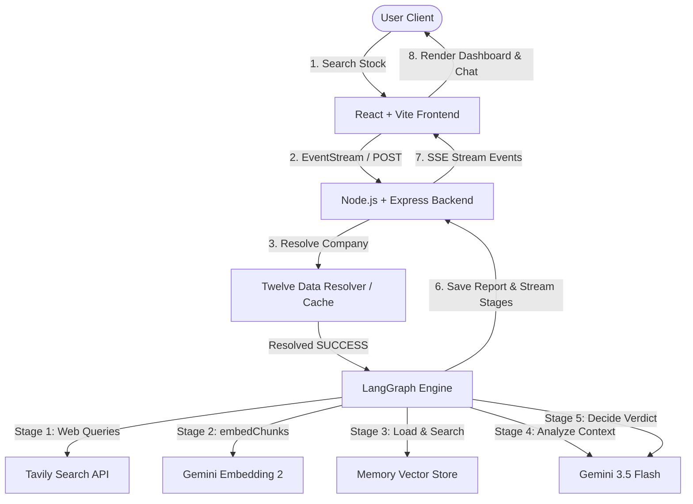

# InvestIQ - AI Investment Research Assistant

InvestIQ is a premium, real-time AI Investment Research Agent. It automates equity due diligence by resolving target stock names using **Twelve Data**, searching the web for real-time information, indexing it locally in a vector database, performing semantic retrieval, and orchestrating analytical reasoning via a multi-stage LangGraph workflow powered by **Gemini 3.5 Flash**.

---

## 1. Problem Statement
Retail investors and equity research analysts spend hours hunting down recent news, scraping financial statements, and compiling risk analyses for target stocks. Standard LLMs cannot solve this because:
1. They suffer from **knowledge cutoff** limits and do not know about recent news.
2. They **hallucinate** numbers and risk metrics without grounding.
3. Linear chat models lack the **structured routing** needed for multi-stage research workflows.

InvestIQ solves this by combining **Twelve Data symbol search**, **Real-time Web Search (Tavily)**, **In-Memory Vector Search (RAG)**, and **Multi-Agent Orchestration (LangGraph)** to synthesize structured investment decisions.

---

## 2. System Architecture Diagram



---

## 3. Tech Stack

### Frontend
* **Core**: React 18, Vite (Fast Bundler)
* **Styling**: Tailwind CSS configured with a sleek dark-mode trading terminal theme.
* **State & Router**: React Context (Auth context), React Router DOM.
* **Streaming**: HTML5 `EventSource` for Server-Sent Events (SSE).

### Backend
* **Core**: Node.js, Express.js.
* **Symbol Resolution**: **Twelve Data Symbol Search API** with a 24-hour custom `CompanyCache` memory layer.
* **AI Orchestration**: `@langchain/langgraph` (StateGraph workflow coordination).
* **AI Models**: `@langchain/google-genai` wrapping `gemini-3.5-flash` (reasoning) and `text-embedding-004` (vectors).
* **Real-time Search**: `@tavily/core` (AI-optimized web search).
* **Database**: Mongoose + MongoDB Atlas (stores user sessions, search history, and research reports).
* **Authentication**: JWT (`jsonwebtoken`) + Password Hashing (`bcryptjs`).

---

## 4. Environment Setup

### Backend Environment (`backend/.env`)
```env
MONGODB_URI=mongodb+srv://<username>:<password>@cluster.mongodb.net/investiq
PORT=5001
NODE_ENV=development
JWT_SECRET=your_jwt_secret_token
GEMINI_API_KEY=your_google_gemini_api_key
TAVILY_API_KEY=your_tavily_search_api_key
TWELVEDATA_API_KEY=your_twelve_data_api_key
```

### Frontend Environment (`frontend/.env`)
```env
VITE_API_URL=http://localhost:5001
```

---

## 5. Installation & Running Locally

### Step 1: Install backend dependencies
```bash
cd backend
npm install
```

### Step 2: Install frontend dependencies
```bash
cd ../frontend
npm install
```

### Step 3: Run development servers
Start the backend API server:
```bash
cd ../backend
npm run dev
```

Start the React client application:
```bash
cd ../frontend
npm run dev
```

Open your browser to `http://localhost:5173`.
