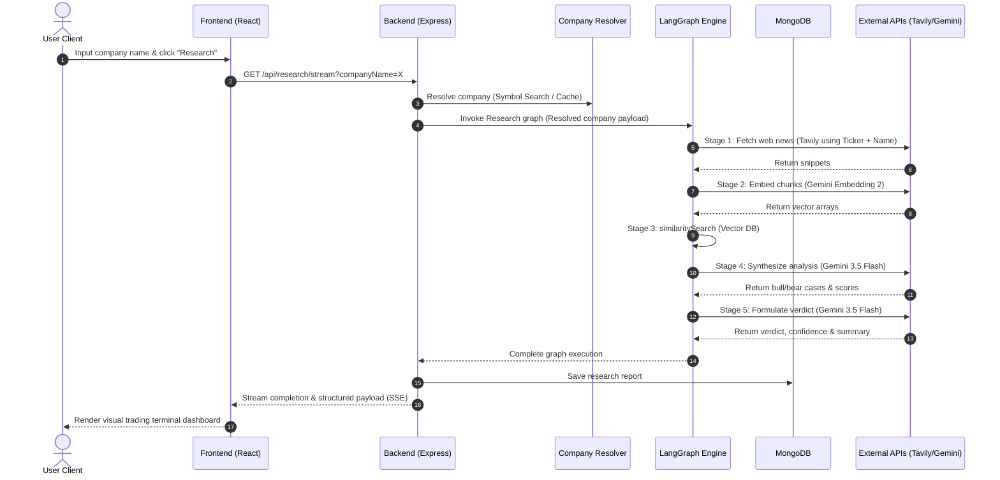

# System Architecture

This document details the architectural layout, data flow, and design choices of the InvestIQ research platform.

---

## 1. Architectural Layers

The following sequence details how a search request traverses through the system:

---

## 2. Layer-by-Layer Breakdown

### 1. Presentation Layer (Frontend)
* **Technology**: React.js, Tailwind CSS, Vite.
* **Role**: Renders a dark-mode terminal layout. It uses Server-Sent Events (SSE) via HTML5 `EventSource` to establish a persistent HTTP connection to the backend, enabling the rendering of real-time progress checkboxes as each AI node completes.
* **Selection Rationale**: React allows modular building of dashboard components (verdict badges, progress checks, cited lists) with fast state changes. Tailwind enables a styling configuration resembling a premium fintech terminal without bulky UI packages.

### 2. Orchestration Layer (Backend Server)
* **Technology**: Node.js, Express.js.
* **Role**: Handles HTTP routing, JWT user sessions, database calls, and LangGraph executions.
* **Selection Rationale**: Node.js is asynchronous and event-driven, which makes it perfect for managing long-lived Server-Sent Events (SSE) connections. Express is minimal and stays out of the way of the LangChain APIs.

### 3. Company Resolution Layer (Twelve Data & Cache)
* **Technology**: Twelve Data Symbol Search API + `CompanyCache` Class.
* **Role**: Resolves raw user queries (e.g. "Apple" or "AAPL") to verified public listings before starting the RAG graph. Prevents garbage inputs from entering the AI pipeline and maps queries to a structured resolved company object.
* **Selection Rationale**: Twelve Data provides international symbol search (supporting US, Indian, European exchanges) and returns structured listings. Caching resolutions for 24 hours reduces API key usage and network latency.

### 4. Workflow Engine (LangGraph)
* **Technology**: `@langchain/langgraph` (StateGraph).
* **Role**: Coordinates the multi-step research pipeline. It ensures nodes are executed in strict sequential order (Search → Embed → Retrieve → Analyze → Decide), updating a shared memory state channel along the way.
* **Selection Rationale**: Standard LLM chains are linear. LangGraph models workflows as mathematical graphs, letting us control state transitions, track progress stages, and hook callbacks into individual nodes to stream progress to the user.

### 5. Search Layer (Tavily)
* **Technology**: `@tavily/core`.
* **Role**: Performs 3 parallel web searches on target stock keywords ("financial performance", "news", "controversies") using the resolved company name and ticker to fetch high-quality, real-time web context.
* **Selection Rationale**: Traditional Google Search APIs return raw HTML and generic links. Tavily is optimized for LLM RAG pipelines, returning summarized, relevant content snippets with clean source URLs.

### 6. Vector Storage & RAG (MemoryVectorStore)
* **Technology**: Custom `MemoryVectorStore` subclassing `@langchain/core/vectorstores`.
* **Role**: Generates high-dimensional embeddings for text chunks using Google's `text-embedding-004` model, stores them in memory, and performs linear cosine similarity scans to extract relevant chunks.
* **Selection Rationale**: Since stock research is session-specific, setting up an external vector database (like Pinecone or Chroma) adds unnecessary network overhead and operational cost. Storing vectors in memory for the duration of a single graph run is fast, secure, and cost-effective.

### 7. Reasoner & Parser (Gemini)
* **Technology**: `ChatGoogleGenerativeAI` (`gemini-3.5-flash`).
* **Role**: Acts as the brain of the agent. It parses retrieved documents, extracts bull/bear arguments, formats structured scores, and generates the final recommendation verdict.
* **Selection Rationale**: Gemini 3.5 Flash offers low latency and excellent JSON output schema conformance (`responseSchema` configurations) at low cost.

### 8. Database Layer (MongoDB)
* **Technology**: Mongoose + MongoDB Atlas.
* **Role**: Stores user session profiles and persistent research reports.
* **Selection Rationale**: The output of an AI agent is highly unstructured and subject to schema adjustments as prompts evolve. MongoDB's document-based storage handles nested JSON reports natively without migration scripts.
