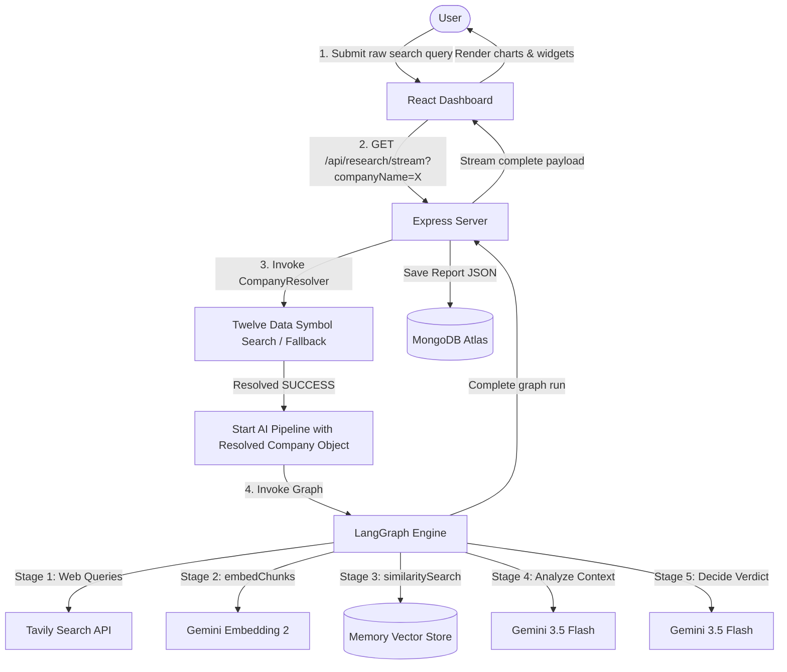

# InvestIQ - Final Project Report

This document compiles the complete system design, folder structure, database schemas, security configurations, and API endpoints of the InvestIQ research platform.

---

## 1. Directory Structure Specifications

### Backend Layout (`/backend`)
* **`src/server.js`**: The Express server entry point. Loads routes, registers global middlewares (CORS, JSON Parser), and listens on port `5001`.
* **`src/config/env.js`**: ESM-hoisting-safe bootstrap module executing `dotenv.config({ override: true })` immediately upon server startup.
* **`src/config/db.js`**: Database connector utilizing Mongoose to bind to the MongoDB Atlas cluster.
* **`src/middleware/requireAuth.js`**: Authentication guard verifying incoming `Authorization: Bearer <token>` JWT headers.
* **`src/models/User.js`**: MongoDB user model schema (email indexing, password hashes).
* **`src/models/Research.js`**: MongoDB report model schema (stores verdicts, scores, cases, ratings, and metadata).
* **`src/services/companyResolver.js`**: Reusable company resolution service utilizing Twelve Data Symbol Search and fallback local registries, backed by a 24-hour `CompanyCache` abstraction.
* **`src/routes/auth.js`**: Exposes login and sign-up controllers, password salting (`bcryptjs`), and token signing (`jsonwebtoken`).
* **`src/routes/research.js`**: Houses research triggers (POST) and Server-Sent Events (GET stream), resolving raw inputs internally before starting the AI pipeline.
* **`src/routes/compare.js`**: Exposes the dual-report comparison controller, invoking Gemini 3.5 Flash for reasoning.
* **`src/agent/graph.js`**: Coordinates the LangGraph StateGraph research nodes (Search, Embed, Retrieve, Analyze, Decide) using the resolved company metadata.
* **`src/agent/vectorStore.js`**: Implements custom `MemoryVectorStore` subclassing `@langchain/core/vectorstores` alongside text chunking and similarity math helpers.
* **`src/agent/prompts.js`**: Exposes Zod schemas (`analysisSchema`, `decisionSchema`, `comparisonSchema`) and prompt-formatting helpers.
* **`src/agent/tools.js`**: Exposes parallel Tavily search executors.

### Frontend Layout (`/frontend`)
* **`src/main.jsx`** & **`src/App.jsx`**: React entry points configuring browser routing guards and global contexts.
* **`src/api/client.js`**: Hook wrapper injecting Authorization headers on fetch calls.
* **`src/context/AuthContext.jsx`**: Manages user login state and localStorage caching.
* **`src/components/ResearchChat.jsx`**: Premium terminal-styled chat widget for context-grounded stock querying.
* **`src/components/ResearchResultCard.jsx`**: Primary dashboard component managing scores, cases, citations, and chat toggles.
* **`src/components/ScoreBar.jsx`**: Renders metric scores with custom indicator widths.
* **`src/components/BullBearSplit.jsx`**: Displays positive and negative indicators in a responsive grid.
* **`src/components/SourcesList.jsx`**: Cited hyperlinks toggle panel.
* **`src/components/CompareView.jsx`**: Compares two saved research reports side-by-side.

---

## 2. Request Lifecycle & Real-time SSE Workflow

---

## 3. Database Schemas & Relationships

### 1. `users` Collection
* **Fields**:
  * `email` (String, unique, lowercase)
  * `passwordHash` (String, encrypted via bcrypt)
  * `createdAt` (Date)

### 2. `researches` Collection
* **Fields**:
  * `userId` (ObjectId referencing User model)
  * `companyName` (String, indexed)
  * `verdict` (String, legacy verdict rating)
  * `recommendation` (String, enum: `['Strong Buy', 'Buy', 'Hold', 'Pass', 'Avoid']`)
  * `investmentScore` (Number, 0-100)
  * `confidence` (Number, 0-100)
  * `summary` (String, executive summary)
  * `bullCase` (Array of Strings, 3 to 4 points)
  * `bearCase` (Array of Strings, 3 to 4 points)
  * `scores` (Object: `businessQuality`, `financialHealth`, `valuation`, `growthPotential`, `risk`)
  * `investmentHorizon` (String)
  * `valuationStatus` (String, e.g. `Undervalued`)
  * `suitableInvestorProfile` (String)
  * `whyNotInvestNow` (Object: `{ reason, negativeMetrics, futureTriggers, monitoringParameters }`)
  * `sources` (Array of Objects: `{ title, url }`)
  * `meta` (Object: `durationSeconds`, `sourcesAnalyzed`, `llmCalls`, `researchDate`)
  * `createdAt` (Date)

---

## 4. API Endpoints Contract

### Auth Endpoints
* `POST /api/auth/signup`: Sign up a new user (Public). Returns JWT and user email.
* `POST /api/auth/login`: Authenticate existing user (Public). Returns JWT.

### Research Endpoints
* `POST /api/research`: Trigger stock research (Private). Returns final report.
* `GET /api/research/stream`: SSE research connection (Private). Streams stages `1` through `4` and `complete`.
* `GET /api/research/history`: Fetch research list for user (Private).
* `GET /api/research/:id`: Get full report by ID (Private).
* `POST /api/research/:id/chat`: Context-grounded chat (Private).

### Comparison Endpoints
* `GET /api/compare?ids=id1,id2`: Compare two reports side-by-side using Gemini (Private).
